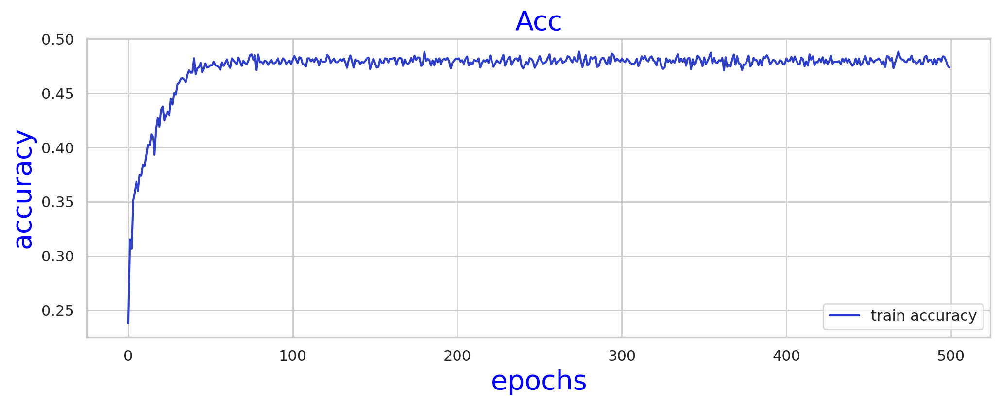
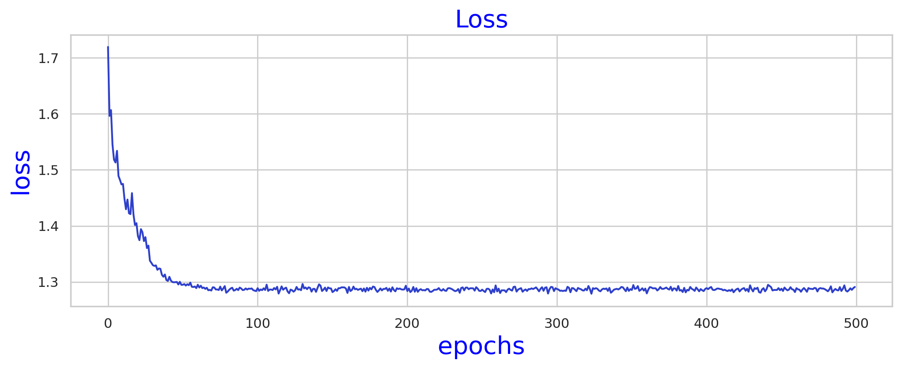

# Speech Emotion Detection using LSTM

A deep learning project to detect emotions from speech using Long Short-Term Memory (LSTM) networks. The project includes a Jupyter notebook for model training and an application script powered by Streamlit for real-time emotion detection.

## Table of Contents

- [Introduction](#introduction)
- [Installation](#installation)
- [Usage](#usage)
- [Files](#files)
- [Model Performance](#model-performance)
- [Contributing](#contributing)
- [License](#license)
- [Contact](#contact)
- [Acknowledgements](#acknowledgements)

## Introduction

This project aims to classify emotions from speech using LSTM, a type of Recurrent Neural Network (RNN) that is well-suited for sequence prediction problems. The model can identify emotions such as happiness, sadness, anger, fear, etc., from audio recordings.

## Installation

To get started with the project, follow these steps:

1. Clone the repository:
    ```bash
    git clone https://github.com/Koustavdas0423/Emotion-Echo.git
    cd speech-emotion-detection
    ```

2. Create and activate a virtual environment:
    ```bash
    python3 -m venv venv
    source venv/bin/activate   # On Windows, use `venv\Scripts\activate`
    ```

3. Install the required dependencies:
    ```bash
    pip install -r requirements.txt
    ```

## Usage

To run the project, you can either train the model using the Jupyter notebook or use the Streamlit app for real-time emotion detection.

### Training the Model

Open the Jupyter notebook `Speech Emotion Detection using LSTM.ipynb` to train the model:
    ```bash
    jupyter notebook "Speech Emotion Detection using LSTM.ipynb"
    ```

Follow the steps in the notebook to preprocess the data, train the model, and evaluate its performance.

### Running the Streamlit App

To run the Streamlit app for real-time emotion detection, execute the following command:
    ```bash
    streamlit run app.py
    ```

This will start a local web server. Open your web browser and navigate to the provided URL to interact with the application.

## Files

- `Speech Emotion Detection using LSTM.ipynb`: Jupyter notebook for training and evaluating the LSTM model.
- `app.py`: Streamlit application script for real-time emotion detection.

## Model Performance

The training and validation performance of the model is visualized below.

### Accuracy



### Loss



## Contributing

Contributions are welcome! If you want to contribute, please follow these steps:

1. Fork the repository.
2. Create your feature branch (`git checkout -b feature/fooBar`).
3. Commit your changes (`git commit -am 'Add some fooBar'`).
4. Push to the branch (`git push origin feature/fooBar`).
5. Create a new Pull Request.

## License

This project is licensed under the MIT License - see the [LICENSE.md](LICENSE.md) file for details.

## Contact

Koustav Das - koustavsamuirai410@gmail.com

Project Link: [https://github.com/Koustavdas0423/Emotion-Echo](https://github.com/Koustavdas0423/Emotion-echo)

## Acknowledgements

- Thanks to the creators of the kaggle datasets for speech emotion recognition(i used Crema for inference).
- Inspired by various deep learning and speech processing research papers.
- Special thanks to my mentors and peers who provided valuable feedback.
